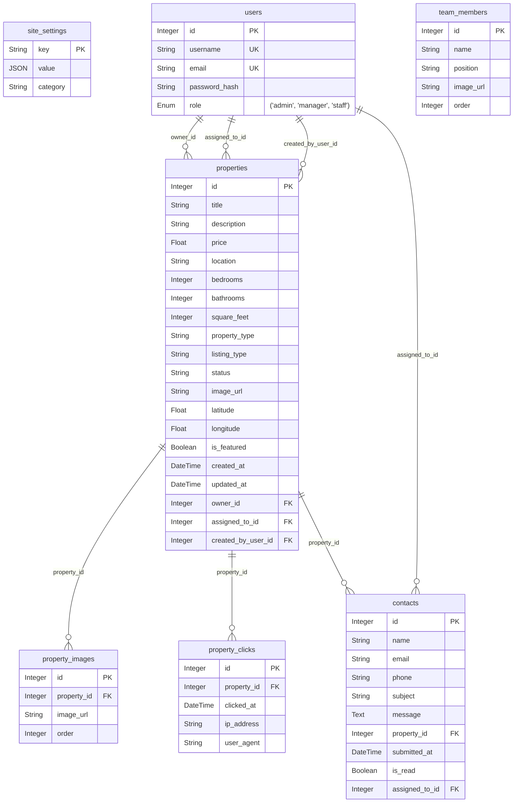

# Database Schema Details

This document provides a comprehensive overview of the database schema for the application, based on the SQLAlchemy models defined in `backend/models.py`.

**Database System:** SQLite (inferred from `habitat_api.db` and common SQLAlchemy development setups)

## Entity Relationship Diagram (ERD)

## Table Details

### 1. `site_settings`

*   **Purpose:** Stores various site-wide configuration settings, such as theme colors, fonts, contact information, or SEO defaults. Settings are stored as key-value pairs, with `value` being a JSON object to accommodate complex data structures.
*   **SQLAlchemy Model:** `SiteSettings`

**Columns:**

| Name     | SQLAlchemy Data Type | Inferred SQLite Type | Constraints                                  | Description                                                                 |
| :------- | :------------------- | :------------------- | :------------------------------------------- | :-------------------------------------------------------------------------- |
| `key`    | `String`             | `TEXT`               | `primary_key=True`, `index=True`             | The unique identifier for the setting.                                      |
| `value`  | `JSON`               | `TEXT`               |                                              | The value of the setting, stored as a JSON object.                          |
| `category`| `String`            | `TEXT`               | `index=True`, `default='General'`            | A category to group settings (e.g., General, Contact, Theme, SEO).        |

**Relationships:**

*   None explicitly defined with other tables via foreign keys in this model.

---

### 2. `users`

*   **Purpose:** Stores information about registered users of the application, including their credentials, roles, and associations with other entities like properties and contacts.
*   **SQLAlchemy Model:** `User`
*   **Associated Enum:** `Role` (values: "admin", "manager", "staff") - stored as TEXT in the database.

**Columns:**

| Name            | SQLAlchemy Data Type | Inferred SQLite Type | Constraints                                                        | Description                                                                 |
| :-------------- | :------------------- | :------------------- | :----------------------------------------------------------------- | :-------------------------------------------------------------------------- |
| `id`            | `Integer`            | `INTEGER`            | `primary_key=True`, `index=True`                                   | Unique identifier for the user.                                             |
| `username`      | `String`             | `TEXT`               | `unique=True`, `index=True`, `nullable=False`                      | The user's unique username.                                                 |
| `email`         | `String`             | `TEXT`               | `unique=True`, `index=True`, `nullable=False`                      | The user's unique email address.                                            |
| `password_hash` | `String`             | `TEXT`               | `nullable=False`                                                   | The hashed password for the user.                                           |
| `role`          | `Enum(Role)`         | `TEXT`               | `default=Role.staff`, `nullable=False`                             | The role assigned to the user (admin, manager, staff).                      |

**Relationships:**

*   **`properties`**: One-to-Many with `Property`.
    *   **Local Key(s):** `User.id`
    *   **Remote Key(s):** `Property.owner_id`
    *   **Nature:** A user can own multiple properties.
    *   **SQLAlchemy:** `relationship("Property", foreign_keys="[Property.owner_id]", back_populates="owner")`
*   **`assigned_contacts`**: One-to-Many with `Contact`.
    *   **Local Key(s):** `User.id`
    *   **Remote Key(s):** `Contact.assigned_to_id`
    *   **Nature:** A user can be assigned to multiple contacts.
    *   **SQLAlchemy:** `relationship("Contact", foreign_keys="[Contact.assigned_to_id]", back_populates="assigned_to")`
*   **`assigned_properties`**: One-to-Many with `Property`.
    *   **Local Key(s):** `User.id`
    *   **Remote Key(s):** `Property.assigned_to_id`
    *   **Nature:** A user can be assigned to multiple properties.
    *   **SQLAlchemy:** `relationship("Property", foreign_keys="[Property.assigned_to_id]", back_populates="assigned_to")`
*   **`created_properties`**: One-to-Many with `Property`.
    *   **Local Key(s):** `User.id`
    *   **Remote Key(s):** `Property.created_by_user_id`
    *   **Nature:** A user can create multiple properties.
    *   **SQLAlchemy:** `relationship("Property", foreign_keys="[Property.created_by_user_id]", back_populates="created_by")`

---

### 3. `properties`

*   **Purpose:** Stores detailed information about real estate properties or listings, including their attributes, location, status, and associations with users (owner, assigned agent, creator) and images.
*   **SQLAlchemy Model:** `Property`

**Columns:**

| Name                 | SQLAlchemy Data Type     | Inferred SQLite Type | Constraints                                      | Description                                                                  |
| :------------------- | :----------------------- | :------------------- | :----------------------------------------------- | :--------------------------------------------------------------------------- |
| `id`                 | `Integer`                | `INTEGER`            | `primary_key=True`, `index=True`                 | Unique identifier for the property.                                          |
| `title`              | `String`                 | `TEXT`               | `index=True`                                     | The title of the property listing.                                           |
| `description`        | `String`                 | `TEXT`               |                                                  | A detailed description of the property.                                      |
| `price`              | `Float`                  | `REAL`               |                                                  | The price of the property.                                                   |
| `location`           | `String`                 | `TEXT`               |                                                  | The address or general location of the property.                             |
| `bedrooms`           | `Integer`                | `INTEGER`            |                                                  | Number of bedrooms.                                                          |
| `bathrooms`          | `Integer`                | `INTEGER`            |                                                  | Number of bathrooms.                                                         |
| `square_feet`        | `Integer`                | `INTEGER`            |                                                  | The area of the property in square feet.                                     |
| `property_type`      | `String`                 | `TEXT`               |                                                  | Type of property (e.g., 'House', 'Apartment', 'Condo').                      |
| `listing_type`       | `String`                 | `TEXT`               | `nullable=True`                                  | Type of listing (e.g., 'For Sale', 'For Rent').                              |
| `status`             | `String`                 | `TEXT`               | `default="available"`                            | Current status of the property (e.g., 'available', 'sold', 'pending').       |
| `image_url`          | `String`                 | `TEXT`               | `nullable=True`                                  | URL of the main image for the property.                                      |
| `latitude`           | `Float`                  | `REAL`               | `nullable=True`                                  | Geographic latitude of the property.                                         |
| `longitude`          | `Float`                  | `REAL`               | `nullable=True`                                  | Geographic longitude of the property.                                        |
| `is_featured`        | `Boolean`                | `BOOLEAN` (INTEGER)  | `default=False`                                  | Indicates if the property is featured.                                       |
| `created_at`         | `DateTime(timezone=True)`| `DATETIME`           | `server_default=func.now()`                      | Timestamp of when the property record was created.                           |
| `updated_at`         | `DateTime(timezone=True)`| `DATETIME`           | `onupdate=func.now()`                            | Timestamp of when the property record was last updated.                      |
| `owner_id`           | `Integer`                | `INTEGER`            | `ForeignKey("users.id")`, `nullable=True`        | Foreign key referencing the owner user.                                      |
| `assigned_to_id`     | `Integer`                | `INTEGER`            | `ForeignKey("users.id")`, `nullable=True`        | Foreign key referencing the user assigned to this property.                  |
| `created_by_user_id` | `Integer`                | `INTEGER`            | `ForeignKey("users.id")`, `nullable=True`        | Foreign key referencing the user who created this property record.           |

**Relationships:**

*   **`owner`**: Many-to-One with `User`.
    *   **Local Key(s):** `Property.owner_id`
    *   **Remote Key(s):** `User.id`
    *   **Nature:** Each property has one owner.
    *   **SQLAlchemy:** `relationship("User", foreign_keys=[owner_id], back_populates="properties")`
*   **`assigned_to`**: Many-to-One with `User`.
    *   **Local Key(s):** `Property.assigned_to_id`
    *   **Remote Key(s):** `User.id`
    *   **Nature:** Each property can be assigned to one user.
    *   **SQLAlchemy:** `relationship("User", foreign_keys=[assigned_to_id], back_populates="assigned_properties")`
*   **`created_by`**: Many-to-One with `User`.
    *   **Local Key(s):** `Property.created_by_user_id`
    *   **Remote Key(s):** `User.id`
    *   **Nature:** Each property is created by one user.
    *   **SQLAlchemy:** `relationship("User", foreign_keys=[created_by_user_id], back_populates="created_properties")`
*   **`images`**: One-to-Many with `PropertyImage`.
    *   **Local Key(s):** `Property.id`
    *   **Remote Key(s):** `PropertyImage.property_id`
    *   **Nature:** A property can have multiple images.
    *   **SQLAlchemy:** `relationship("PropertyImage", back_populates="property", cascade="all, delete-orphan")`
*   **`clicks`**: One-to-Many with `PropertyClick`.
    *   **Local Key(s):** `Property.id`
    *   **Remote Key(s):** `PropertyClick.property_id`
    *   **Nature:** A property can have multiple click records.
    *   **SQLAlchemy:** `relationship("PropertyClick", back_populates="property")`

---

### 4. `property_images`

*   **Purpose:** Stores URLs and ordering information for images associated with a specific property, allowing for a gallery of images per property.
*   **SQLAlchemy Model:** `PropertyImage`

**Columns:**

| Name          | SQLAlchemy Data Type | Inferred SQLite Type | Constraints                                      | Description                                                              |
| :------------ | :------------------- | :------------------- | :----------------------------------------------- | :----------------------------------------------------------------------- |
| `id`          | `Integer`            | `INTEGER`            | `primary_key=True`, `index=True`                 | Unique identifier for the property image.                                |
| `property_id` | `Integer`            | `INTEGER`            | `ForeignKey("properties.id")`, `nullable=False`  | Foreign key referencing the property this image belongs to.              |
| `image_url`   | `String`             | `TEXT`               | `nullable=False`                                 | URL of the image.                                                        |
| `order`       | `Integer`            | `INTEGER`            | `default=0`                                      | Used for ordering images in a gallery.                                   |

**Relationships:**

*   **`property`**: Many-to-One with `Property`.
    *   **Local Key(s):** `PropertyImage.property_id`
    *   **Remote Key(s):** `Property.id`
    *   **Nature:** Each image belongs to one property.
    *   **SQLAlchemy:** `relationship("Property", back_populates="images")`

---

### 5. `team_members`

*   **Purpose:** Stores information about team members, such as their name, position, and an image. This is typically used for display on an "About Us" or "Our Team" page.
*   **SQLAlchemy Model:** `TeamMember`

**Columns:**

| Name        | SQLAlchemy Data Type | Inferred SQLite Type | Constraints                      | Description                                     |
| :---------- | :------------------- | :------------------- | :------------------------------- | :---------------------------------------------- |
| `id`        | `Integer`            | `INTEGER`            | `primary_key=True`, `index=True` | Unique identifier for the team member.          |
| `name`      | `String`             | `TEXT`               | `nullable=False`                 | Name of the team member.                        |
| `position`  | `String`             | `TEXT`               |                                  | Position or title of the team member.           |
| `image_url` | `String`             | `TEXT`               | `nullable=True`                  | URL of the team member's image.                 |
| `order`     | `Integer`            | `INTEGER`            | `default=0`                      | Used for ordering team members in a list.       |

**Relationships:**

*   None explicitly defined with other tables via foreign keys in this model.

---

### 6. `contacts`

*   **Purpose:** Stores contact requests or messages submitted through the website, including sender details, message content, and potentially linking to a specific property or an assigned user.
*   **SQLAlchemy Model:** `Contact`

**Columns:**

| Name             | SQLAlchemy Data Type     | Inferred SQLite Type | Constraints                                      | Description                                                                  |
| :--------------- | :----------------------- | :------------------- | :----------------------------------------------- | :--------------------------------------------------------------------------- |
| `id`             | `Integer`                | `INTEGER`            | `primary_key=True`, `index=True`                 | Unique identifier for the contact entry.                                     |
| `name`           | `String`                 | `TEXT`               | `nullable=False`                                 | Name of the person who submitted the contact request.                        |
| `email`          | `String`                 | `TEXT`               |                                                  | Email address of the contact.                                                |
| `phone`          | `String`                 | `TEXT`               | `nullable=True`                                  | Phone number of the contact.                                                 |
| `subject`        | `String`                 | `TEXT`               | `nullable=True`                                  | Subject of the contact message.                                              |
| `message`        | `Text`                   | `TEXT`               | `nullable=False`                                 | The content of the message.                                                  |
| `property_id`    | `Integer`                | `INTEGER`            | `ForeignKey("properties.id")`, `nullable=True`   | Foreign key linking to a property, if the contact is about a specific property. |
| `submitted_at`   | `DateTime(timezone=True)`| `DATETIME`           | `server_default=func.now()`                      | Timestamp of when the contact request was submitted.                         |
| `is_read`        | `Boolean`                | `BOOLEAN` (INTEGER)  | `default=False`                                  | Indicates if the contact message has been read.                              |
| `assigned_to_id` | `Integer`                | `INTEGER`            | `ForeignKey("users.id")`, `nullable=True`        | Foreign key referencing the user assigned to handle this contact.            |

**Relationships:**

*   **`assigned_to`**: Many-to-One with `User`.
    *   **Local Key(s):** `Contact.assigned_to_id`
    *   **Remote Key(s):** `User.id`
    *   **Nature:** Each contact can be assigned to one user.
    *   **SQLAlchemy:** `relationship("User", foreign_keys=[assigned_to_id], back_populates="assigned_contacts")`
*   **`property`** (Implied by Foreign Key `property_id`): Many-to-One with `Property`.
    *   **Local Key(s):** `Contact.property_id`
    *   **Remote Key(s):** `Property.id`
    *   **Nature:** A contact message can be related to one property.
    *   **SQLAlchemy:** (Relationship attribute `property` is commented out in the model but the FK `property_id` exists).

---

### 7. `property_clicks`

*   **Purpose:** Tracks clicks or views on property listings, which can be used for analytics, understanding property popularity, or monitoring engagement.
*   **SQLAlchemy Model:** `PropertyClick`

**Columns:**

| Name          | SQLAlchemy Data Type     | Inferred SQLite Type | Constraints                                      | Description                                                        |
| :------------ | :----------------------- | :------------------- | :----------------------------------------------- | :----------------------------------------------------------------- |
| `id`          | `Integer`                | `INTEGER`            | `primary_key=True`, `index=True`                 | Unique identifier for the click record.                            |
| `property_id` | `Integer`                | `INTEGER`            | `ForeignKey("properties.id")`, `nullable=False`  | Foreign key referencing the property that was clicked.             |
| `clicked_at`  | `DateTime(timezone=True)`| `DATETIME`           | `server_default=func.now()`                      | Timestamp of when the click occurred.                              |
| `ip_address`  | `String`                 | `TEXT`               | `nullable=True`                                  | IP address of the user who clicked.                                |
| `user_agent`  | `String`                 | `TEXT`               | `nullable=True`                                  | User agent string of the browser/client that made the click.       |

**Relationships:**

*   **`property`**: Many-to-One with `Property`.
    *   **Local Key(s):** `PropertyClick.property_id`
    *   **Remote Key(s):** `Property.id`
    *   **Nature:** Each click record belongs to one property.
    *   **SQLAlchemy:** `relationship("Property", back_populates="clicks")`

---