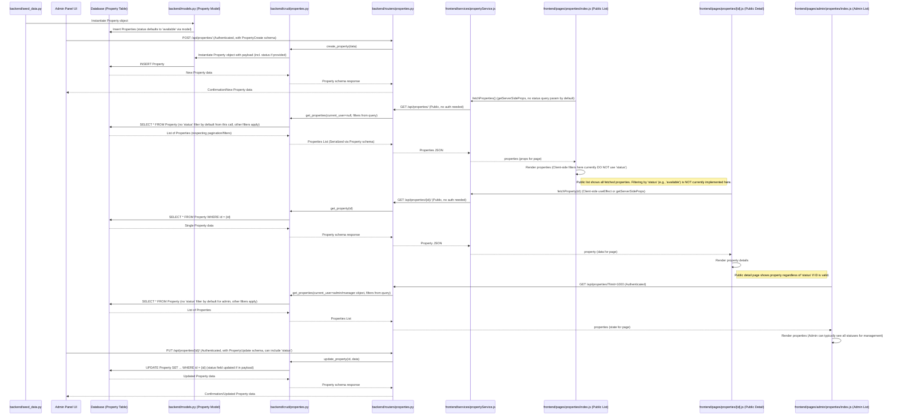
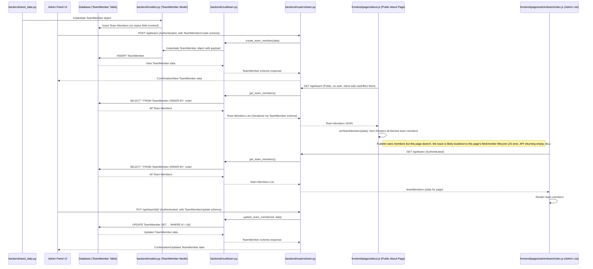

# Data Flow Diagrams: Listings & Team Members

## 1. Introduction

This document illustrates the data flow for two core entities in the application: 'listings' (properties) and 'team members'. The aim is to provide a clear understanding of how data originates, is processed, and is presented on both the administrative and public-facing sides of the application. This documentation is intended to aid in debugging, onboarding, and long-term maintenance.

The diagrams and descriptions are based on information from [`APPLICATION_ARCHITECTURE.md`](APPLICATION_ARCHITECTURE.md:1), `DATA_LIFECYCLE_ANALYSIS.md`, and [`SYSTEM_ARCHITECTURAL_MAP.md`](SYSTEM_ARCHITECTURAL_MAP.md:1).

## 2. Listings Data Flow

This section details the lifecycle of 'listing' (property) data.

### 2.1. Listings Data Flow Diagram

### 2.2. Listings Data Flow Elaboration

*   **Data Sources:**
    *   **Database Seeding:** Initial property data can be populated via [`backend/seed_data.py`](backend/seed_data.py:1). The [`Property` model](backend/models.py:43) in [`backend/models.py`](backend/models.py:43) defines a `status` field with a default value of `"available"`.
    *   **Admin Panel:** New listings are created, and existing ones are updated, through the admin interface. User input is translated into API calls to the backend.

*   **Backend Processing:**
    *   **Models ([`backend/models.py`](backend/models.py:43)):** The `Property` model is central, containing fields like `title`, `price`, `location`, `is_featured`, and the crucial `status` field.
    *   **CRUD Layer ([`backend/crud/properties.py`](backend/crud/properties.py:1)):**
        *   `create_property()`: Handles the creation of new property records.
        *   `get_property()`: Fetches a single property by its ID.
        *   `get_properties()`: Fetches a list of properties. By default, this function does *not* filter by `status` unless specific query parameters for status are passed. It can filter by other criteria like price, type, etc. For users with the `staff` role, it filters to show only properties assigned to that staff member.
        *   `update_property()`: Updates existing property records, including their `status`.
    *   **API Layer ([`backend/routers/properties.py`](backend/routers/properties.py:1)):**
        *   `GET /api/properties/`: Publicly accessible endpoint to list properties. It relies on `crud_property.get_properties()`.
        *   `POST /api/properties/`: Endpoint for creating new properties. Requires manager-level authentication.
        *   `GET /api/properties/{id}/`: Publicly accessible endpoint to fetch a single property by ID.
        *   `PUT /api/properties/{id}/`: Endpoint for updating existing properties. Requires manager-level authentication.
        *   `DELETE /api/properties/{id}/`: Endpoint for deleting properties. Requires manager-level authentication.

*   **Frontend Consumption (Data Sinks):**
    *   **Admin Side ([`frontend/pages/admin/properties/index.js`](frontend/pages/admin/properties/index.js:1)):**
        *   Fetches properties (typically all, or with admin-specific filters) using authenticated API calls.
        *   Displays properties, allowing administrators to manage them, including changing their `status`.
    *   **Public Side:**
        *   **List View ([`frontend/pages/properties/index.js`](frontend/pages/properties/index.js:1)):**
            *   Fetches properties via `fetchProperties()` in [`frontend/services/propertyService.js`](frontend/services/propertyService.js:1).
            *   Currently, the `getServerSideProps` call to `fetchProperties()` does not pass a `status` filter.
            *   The client-side filtering logic on this page also does not currently filter by `property.status`.
            *   **Implication:** This page will display all properties returned by the API, regardless of their `status` (e.g., 'available', 'sold', 'pending'), unless the API itself is modified or the frontend call specifically requests a status.
        *   **Detail View ([`frontend/pages/properties/[id].js`](frontend/pages/properties/[id].js:1)):**
            *   Fetches a single property by its ID.
            *   Displays the property details if the ID is valid, irrespective of the property's `status`.

*   **Key Transformations/Logic & Filtering:**
    *   The `status` field in the `Property` model defaults to `"available"`.
    *   Admins can change the `status` of a property.
    *   The public-facing property list page ([`frontend/pages/properties/index.js`](frontend/pages/properties/index.js:1)) currently **lacks explicit filtering by `status` (e.g., to show only 'available' properties)**. This is a key area noted in `DATA_LIFECYCLE_ANALYSIS.md` that might lead to discrepancies if properties with statuses other than 'available' are present in the database.

## 3. Team Members Data Flow

This section details the lifecycle of 'team member' data.

### 3.1. Team Members Data Flow Diagram

### 3.2. Team Members Data Flow Elaboration

*   **Data Sources:**
    *   **Database Seeding:** Initial team member data can be populated via [`backend/seed_data.py`](backend/seed_data.py:1).
    *   **Admin Panel:** New team members are added, and existing ones are updated, through the admin interface.

*   **Backend Processing:**
    *   **Models ([`backend/models.py`](backend/models.py:87)):** The `TeamMember` model contains fields like `name`, `position`, `image_url`, and `order`. Critically, it **lacks an explicit `status` or `is_public` field.**
    *   **CRUD Layer ([`backend/crud/team.py`](backend/crud/team.py:1)):**
        *   `create_team_member()`: Handles the creation of new team member records.
        *   `get_team_member()`: Fetches a single team member by ID.
        *   `get_team_members()`: Fetches all team members, typically ordered by the `order` field. No status or visibility filtering is applied here as the model lacks such a field.
        *   `update_team_member()`: Updates existing team member records.
    *   **API Layer ([`backend/routers/team.py`](backend/routers/team.py:1)):**
        *   `GET /api/team/`: Publicly accessible endpoint to list all team members.
        *   `POST /api/team/`: Endpoint for creating new team members. Requires admin-level authentication.
        *   `GET /api/team/{id}/`: Publicly accessible endpoint to fetch a single team member by ID.
        *   `PUT /api/team/{id}/`: Endpoint for updating existing team members. Requires admin-level authentication.
        *   `DELETE /api/team/{id}/`: Endpoint for deleting team members. Requires admin-level authentication.

*   **Frontend Consumption (Data Sinks):**
    *   **Admin Side ([`frontend/pages/admin/team/index.js`](frontend/pages/admin/team/index.js:1)):**
        *   Fetches team member data using authenticated API calls.
        *   Displays all team members, allowing administrators to manage them.
    *   **Public Side ([`frontend/pages/about.js`](frontend/pages/about.js:1)):**
        *   Fetches team member data from the public `GET /api/team/` endpoint, typically in a client-side `useEffect` hook.
        *   Renders all fetched team members, sorted by `order`.
        *   **Potential Issues:** As highlighted in `DATA_LIFECYCLE_ANALYSIS.md`, if team members are visible in admin but not on the public 'About Us' page, the issue is almost certainly localized to the frontend execution of [`frontend/pages/about.js`](frontend/pages/about.js:1). This could be due to JavaScript errors during/after the fetch, the API call returning an empty list or failing, or issues with state updates or rendering logic.

*   **Key Transformations/Logic & Filtering:**
    *   Data is generally presented as-is from the database, as there's no `status` or visibility field to filter on.
    *   The `order` field is used for sorting team members for display.

## 4. General Considerations

*   **Admin vs. Public Paths:** The diagrams and descriptions distinguish how data is accessed and presented differently in administrative UIs versus public-facing pages. Admin paths typically involve authentication and provide access to a broader set of data and operations.
*   **API Endpoints:** Key API endpoints (e.g., `/api/properties/`, `/api/team/`) are identified as the primary channels for data transfer between the frontend and backend.
*   **Data Sources & Sinks:** Data originates from database seeding or user input via the admin panel. It is stored in the database and consumed by frontend components for display in either admin or public UIs.