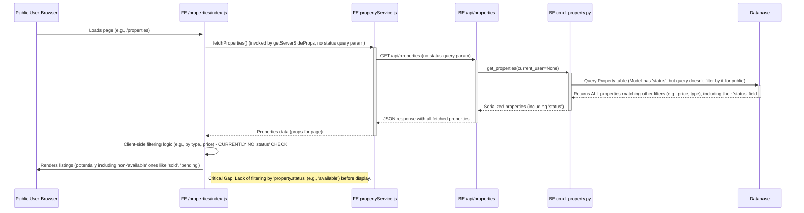
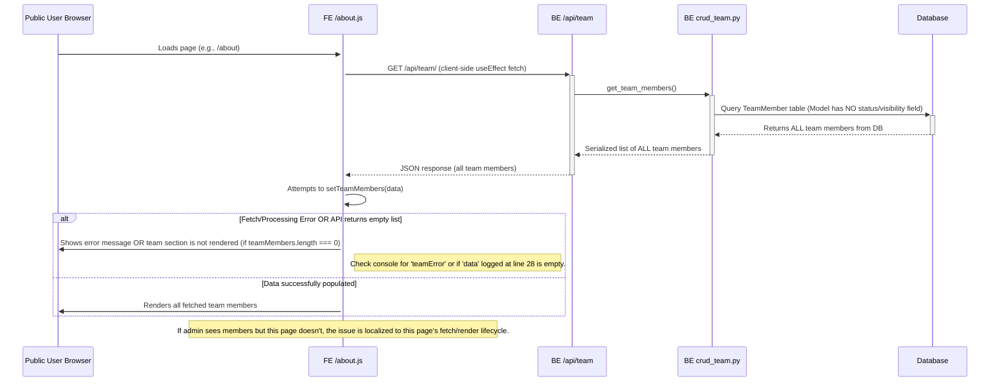
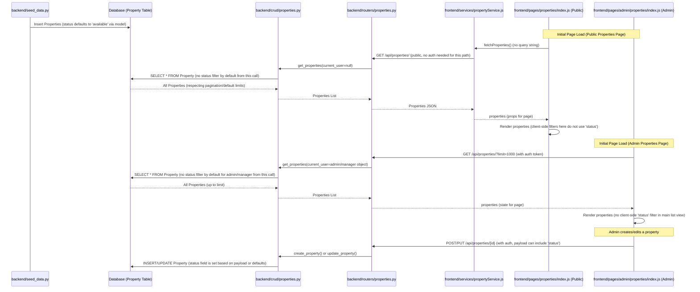
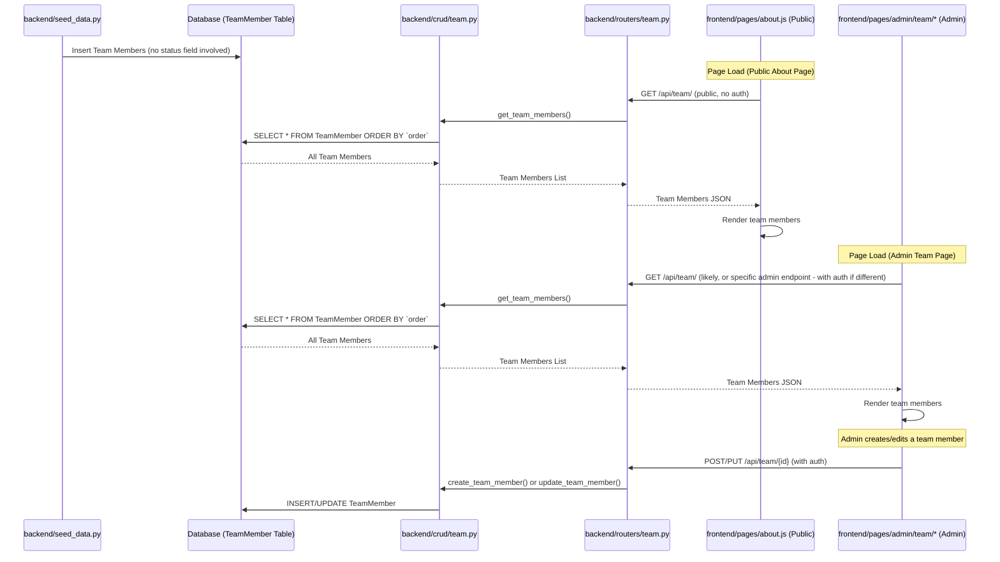

# Data Lifecycle Analysis: Listings & Team Members

**Objective:** To meticulously investigate and document the complete data lifecycle for 'listings' and 'team members', focusing on why seeded data might be visible on the admin side but not the public side of the web application.

## Phase 1: Information Gathering & Analysis (Summary)

This phase involved reviewing the codebase to understand data flow from origin to presentation.

### 1.1 Data Origin (Seeding - [`backend/seed_data.py`](backend/seed_data.py:1))
*   **Listings (Properties):**
    *   Populates `Property` and `PropertyImage` tables.
    *   Key fields seeded: `title`, `description`, `price`, `location`, `property_type`, `bedrooms`, `bathrooms`, `square_feet` (derived from `area`), `image_url` (main image), `images` (gallery), `latitude`, `longitude`, `is_featured`.
    *   The `listing_type` field from the seed data is explicitly removed before creating the `Property` model instance.
    *   The `status` field is not explicitly set during seeding.
*   **Team Members:**
    *   Populates the `TeamMember` table.
    *   Key fields seeded: `name`, `position`, `image_url`, `order`.
    *   No `status` or explicit visibility field is part of the seed data for team members.

### 1.2 Data Structure (Models - [`backend/models.py`](backend/models.py:1))
*   **Listings ([`Property` model](backend/models.py:43)):**
    *   Contains a `status` field: `Column(String, default="available")`. This is crucial as it defaults to 'available' if not otherwise specified.
    *   Includes `is_featured` (Boolean), `created_at`, `updated_at`.
*   **Team Members ([`TeamMember` model](backend/models.py:87)):**
    *   Fields: `id`, `name`, `position`, `image_url`, `order`.
    *   **Critically, lacks an explicit `status` or `is_public` field.**

### 1.3 Backend Data Access (CRUD Operations)
*   **Listings ([`backend/crud/properties.py`](backend/crud/properties.py:1)):**
    *   `get_properties()`:
        *   Does **not** automatically filter by `status` for public (unauthenticated) users or for admin/manager roles unless specific query parameters for status are passed.
        *   If `current_user` is `staff`, it filters to show only properties assigned to that staff member.
    *   `get_property(id)`: Fetches a single property by ID without status filtering.
*   **Team Members ([`backend/crud/team.py`](backend/crud/team.py:1)):**
    *   `get_team_members()`: Fetches all team members, ordered by `order`. No status or visibility filtering.
    *   `get_team_member(id)`: Fetches a single team member by ID without status filtering.

### 1.4 Backend API Exposure (Routers)
*   **Listings ([`backend/routers/properties.py`](backend/routers/properties.py:1)):**
    *   `GET /api/properties/`:
        *   Publicly accessible (uses `get_optional_current_user`).
        *   Calls `crud_property.get_properties()`.
        *   Does **not** add a `status` filter by default at the router level. Passes `current_user` to the CRUD layer.
    *   `GET /api/properties/{id}/`: Publicly accessible. No status filtering.
    *   Admin operations (POST, PUT, DELETE) require manager-level authentication.
*   **Team Members ([`backend/routers/team.py`](backend/routers/team.py:1)):**
    *   `GET /api/team/`: Publicly accessible. No authentication required. Returns all team members.
    *   `GET /api/team/{id}/`: Publicly accessible.
    *   Admin operations (POST, PUT, DELETE) require admin-level authentication.

### 1.5 Frontend Data Consumption
*   **Listings (Public - [`frontend/pages/properties/index.js`](frontend/pages/properties/index.js:1)):**
    *   `getServerSideProps` calls `fetchProperties()` (from [`frontend/services/propertyService.js`](frontend/services/propertyService.js:1)) **without any query string arguments.**
    *   This results in a request to `GET /api/properties` without any `status` filters.
    *   Client-side filtering logic present on this page does **not** use the `property.status` field.
*   **Listings (Admin - [`frontend/pages/admin/properties/index.js`](frontend/pages/admin/properties/index.js:1)):**
    *   Fetches properties via `GET /api/properties/?limit=1000` (sends authentication token).
    *   This request also does **not** include an explicit `status` filter.
    *   The main list display does not show client-side filtering based on `status`.
*   **Team Members (Public - [`frontend/pages/about.js`](frontend/pages/about.js:1)):**
    *   Fetches team data directly from the public `GET /api/team/` endpoint.
    *   Renders all fetched members, sorted by `order`.
*   **Team Members (Admin - Inferred from admin pages like [`frontend/pages/admin/team/index.js`](frontend/pages/admin/team/index.js)):**
    *   Likely fetches from `GET /api/team/` (or a similar admin-specific endpoint if one exists) and displays all members. Admin pages for CRUD operations on team members exist.

## Subtask 1.2: Detailed Code Examination Findings

This section details the findings from a granular review of the frontend and backend code, focusing on how 'listings' and 'team member' data is fetched, processed, and rendered, specifically investigating the visibility discrepancies.

### I. Listings Data Flow & Discrepancy Analysis

*   **Backend Code Summary (`properties.py`, `crud/properties.py`, `models.py`, `schemas.py`):**
    *   The `Property` model ([`backend/models.py:56`](backend/models.py:56)) possesses a `status: Column(String, default="available")` field (e.g., 'available', 'sold', 'pending').
    *   The primary public API endpoint `GET /api/properties/` (defined in [`backend/routers/properties.py:107`](backend/routers/properties.py:107)) and its associated CRUD function `crud_property.get_properties` ([`backend/crud/properties.py:11`](backend/crud/properties.py:11)) do **not** apply a filter based on this `status` field by default for unauthenticated (public) users. They return all properties that match other query parameters (like price, type), including their `status` attribute.
    *   The Pydantic schema `schemas.Property` ([`backend/schemas.py:56`](backend/schemas.py:56)), used for API responses, does not explicitly list the `status` field. However, due to `orm_mode = True` and FastAPI's serialization mechanisms, the `status` field from the `models.Property` object is indeed part of the JSON response sent to the frontend.
    *   Administrative endpoints for property management correctly enforce authentication. The admin listing also retrieves all properties without inherent status filtering at the CRUD level for admin/manager roles.

*   **Frontend Code Summary (Listings - Public View):**
    *   **Service Layer (`frontend/services/propertyService.js`):** The `fetchProperties()` function ([`frontend/services/propertyService.js:16`](frontend/services/propertyService.js:16)) initiates a call to `/api/properties` but does not append any `status` query parameter by default.
    *   **Main Listings Page (`frontend/pages/properties/index.js`):**
        *   The `getServerSideProps` method calls `fetchProperties()` without providing any query string ([`frontend/pages/properties/index.js:74`](frontend/pages/properties/index.js:74)). Consequently, it fetches all properties irrespective of their status.
        *   The client-side filtering logic (within the `useMemo` hook at [`frontend/pages/properties/index.js:20`](frontend/pages/properties/index.js:20)) filters based on category (type), price, bedrooms, etc., but **it does not inspect or filter by the `property.status` field.**
    *   **Individual Listing Page (`frontend/pages/properties/[id].js`):**
        *   This page fetches details for a single property on the client side ([`frontend/pages/properties/[id].js:35`](frontend/pages/properties/[id].js:35)). The backend provides the property data if the ID is valid, regardless of its status.
        *   The page **does not verify `property.status`** before rendering the property's details.
    *   **Property Card Component (`frontend/components/PropertyCard.js`):** This component directly renders the property data it is supplied with, without performing any status checks ([`frontend/components/PropertyCard.js:2-12`](frontend/components/PropertyCard.js:2-12)).

*   **Listings - Admin vs. Public Comparison & Discrepancy Root Cause:**
    *   Both administrative ([`frontend/pages/admin/properties/index.js`](frontend/pages/admin/properties/index.js)) and public-facing pages retrieve property data from the same `/api/properties/` endpoint without an explicit `status` filter in the initial request. The backend, in turn, supplies all properties (matching other filters) to both.
    *   The admin interface displays all fetched properties, which is suitable for management tasks.
    *   The public pages (both list and detail views) also effectively display all fetched properties because they currently lack the necessary logic to filter by `status`.
    *   **Reason for Discrepancy:** Seeded listings (including those that might not be 'available') are visible on the admin side because the admin page is designed to show everything it fetches. These listings are also technically fetched by the public pages. The discrepancy arises because the public pages *should* ideally filter these listings based on a status like 'available' but currently *do not*.

### II. Team Members Data Flow & Discrepancy Analysis

*   **Backend Code Summary (`team.py`, `crud/team.py`, `models.py`, `schemas.py`):**
    *   The `TeamMember` model ([`backend/models.py:87`](backend/models.py:87)) and its corresponding Pydantic schema ([`backend/schemas.py:131`](backend/schemas.py:131), [`backend/schemas.py:146`](backend/schemas.py:146)) do **not** include any field for `status` or `visibility`. This aligns with findings from Subtask 1.1.
    *   The public API endpoint `GET /api/team/` ([`backend/routers/team.py:54`](backend/routers/team.py:54)) and its CRUD function `crud_team.get_team_members` ([`backend/crud/team.py:10`](backend/crud/team.py:10)) are designed to return **all** team members from the database without applying any filtering.
    *   Administrative endpoints for creating, updating, or deleting team members correctly require authentication.

*   **Frontend Code Summary (Team Members - Public View - `frontend/pages/about.js`):**
    *   The page fetches team member data from the public `/api/team/` endpoint ([`frontend/pages/about.js:19`](frontend/pages/about.js:19)) on the client side.
    *   It is designed to receive all team members from the backend.
    *   It then renders all fetched team members provided that `teamMembers.length > 0` ([`frontend/pages/about.js:143-163`](frontend/pages/about.js:143-163)). There is no client-side filtering based on any (non-existent) status field.
    *   Diagnostic logs are present ([`frontend/pages/about.js:28`](frontend/pages/about.js:28), [`frontend/pages/about.js:32`](frontend/pages/about.js:32)) to inspect the received `data` and any `teamError`.

*   **Team Members - Admin vs. Public Comparison & Discrepancy Root Cause:**
    *   Both the admin team management page ([`frontend/pages/admin/team/index.js`](frontend/pages/admin/team/index.js)) and the public `about.js` page utilize the *same* public API endpoint (`/api/team/`) which returns all team members.
    *   Consequently, both pages are supplied with the exact same dataset from the backend.
    *   Both pages aim to render all team members they receive.
    *   **Reason for Discrepancy:** If seeded team members are visible on the admin interface but not on the public `about.js` page, the problem is **almost certainly located within the frontend execution of `frontend/pages/about.js`**. Potential causes include:
        1.  A JavaScript error during or after the `fetch` operation that prevents `setTeamMembers` from being correctly populated, or an error that halts the rendering sequence. The `teamError` state and console logs are vital for diagnosing this.
        2.  The API call within `about.js` might be succeeding but returning an empty array (`[]`), or failing outright. The diagnostic log for `data` ([`frontend/pages/about.js:28`](frontend/pages/about.js:28)) is crucial here. An empty array would indicate no data in the `team_members` table or an unexpected API behavior.
        3.  The conditional rendering logic `teamMembers.length > 0` ([`frontend/pages/about.js:143`](frontend/pages/about.js:143)) would correctly prevent the team section from rendering if `teamMembers` is an empty array.

### III. Visual Data Flow Diagrams (Subtask 1.2)

**Listings Data Lifecycle (Public View - Highlighting Discrepancy):**



**Team Members Data Lifecycle (Public View - Highlighting Potential Failure Points):**



This detailed examination should provide a solid foundation for the subsequent phases of resolving the discrepancies.
The existing "Phase 3: Identifying Discrepancies & Hypotheses" and "Phase 4: Proposed Next Steps" in this document are well-aligned with these detailed findings.
## Phase 2: Diagramming the Data Lifecycle

### Listings Data Lifecycle



### Team Members Data Lifecycle



## Phase 3: Identifying Discrepancies & Hypotheses

*   **Listings (Properties):**
    *   **Observation:**
        *   Properties are seeded without an explicit `status`, so they default to 'available' due to the model definition (`status = Column(String, default="available")`).
        *   Both the public properties page ([`frontend/pages/properties/index.js`](frontend/pages/properties/index.js:1)) and the admin properties page ([`frontend/pages/admin/properties/index.js`](frontend/pages/admin/properties/index.js:1)) fetch listings via `GET /api/properties/` without an explicit `status` filter in the initial API call.
        *   The backend `crud_property.get_properties` function does not apply a default `status` filter for general public users or for admin/manager roles when called without specific status query parameters.
    *   **Hypothesis for Discrepancy ("visible on admin but not public"):**
        1.  **Misinterpretation of "Visible":** The most likely scenario. "Visible in admin" might mean the data records exist and are accessible/editable within the admin system (which is true, as they are fetched). "Not visible in public" might imply an *expectation* that the public page *should only* display properties explicitly marked for public view (e.g., `status='available'`), but the current implementation fetches all (by default 'available') properties and displays them. If some properties were later changed to a non-'available' status via admin, they would still be fetched by the public page unless a filter is added.
        2.  **Admin UI Filtering:** The admin panel might have other UI elements (e.g., tabs for different statuses, advanced search filters not part of the main list's initial fetch) that allow viewing properties of *all* statuses. This makes all data "visible" in a broader sense within the admin context. The public page lacks these comprehensive admin tools.
        3.  **Data Integrity Post-Seed:** If any seeded properties had their status changed to something non-'available' (e.g., 'pending', 'sold', 'draft') *after* seeding via the admin panel, they would still be fetched by the public `properties/index.js` page because it doesn't filter by status. They would also be fetched by the admin page. The discrepancy would only appear if the user *expects* the public page to *only* show 'available' ones.
    *   **Key Point:** The core of the issue for listings, if they are truly not showing publicly when they should, likely revolves around the definition of "publicly visible" and ensuring the public data fetch aligns with that (e.g., by adding a `status=available` filter if that's the intent). Given the default status is 'available', seeded properties *should* be visible on both sides unless their status was changed.

*   **Team Members:**
    *   **Observation:**
        *   The `TeamMember` model has no `status` or `is_public` field.
        *   Backend CRUD and API layers fetch and expose all team members publicly via `GET /api/team/`.
        *   The public `about.js` page ([`frontend/pages/about.js`](frontend/pages/about.js:1)) attempts to fetch all team members from this public endpoint.
    *   **Hypothesis for Discrepancy ("visible on admin but not public"):**
        1.  **Frontend Issue on Public Page (`about.js`):** This is the most probable cause. If team members are confirmed to exist in the database (and thus visible in admin, which also likely fetches all), the problem lies with the public page's frontend:
            *   The `fetch` call in [`frontend/pages/about.js`](frontend/pages/about.js:1) might be failing. The `teamError` state should be inspected.
            *   Incorrect `API_URL` (value of `process.env.NEXT_PUBLIC_API_URL`) resolution in the context where `about.js` is rendered (server-side vs. client-side).
            *   Data fetched but not correctly set to the `teamMembers` state, or an error during this process.
            *   A JavaScript runtime error on the page preventing the rendering of the team section.
            *   CSS or layout issues specifically hiding the team members section, even if the data is present.
        2.  **No Seeded Data / Accidental Deletion:** While the premise is that data is seeded, if for some reason the team members were not seeded or were deleted, they would not appear. This is less likely given the problem statement.

## Phase 4: Proposed Next Steps (For Implementation/Debugging)

These steps are for an engineer to take to debug and resolve the discrepancies:

*   **For Listings (Properties):**
    1.  **Verify Actual Status in DB:** Directly inspect the `properties` table in the `habitat_api.db` for a few sample seeded listings. Confirm their `status` field. (Expected: 'available').
    2.  **Test Public API with Explicit Filter:** Use a tool (like `curl` or Postman) to query `GET /api/properties/?status=available`. Verify it returns the expected set. Then query without the status filter to see the full set.
    3.  **Clarify "Public Visibility" Rule:** Determine if the public listings page *should only* display properties with `status='available'`.
    4.  **Implement Filter (If Required):** If step 3 is yes, modify [`frontend/pages/properties/index.js`](frontend/pages/properties/index.js:1) in `getServerSideProps` to:
        ```javascript
        // const properties = await fetchProperties(); // Old
        const properties = await fetchProperties("status=available"); // New
        ```
    5.  **Inspect Admin UI for Status Handling:** Review how the admin panel allows interaction with the `status` field (e.g., in the property edit form [`frontend/pages/admin/properties/edit/[id].js`](frontend/pages/admin/properties/edit/[id].js)) and if there are views/filters for different statuses.

*   **For Team Members:**
    1.  **Check `teamError` State:** In [`frontend/pages/about.js`](frontend/pages/about.js:1), add `console.log` for the `teamError` state within the `fetchTeamMembers` catch block and after the fetch attempt to see if errors are reported.
        ```javascript
        // Inside fetchTeamMembers in about.js
        } catch (err) {
          setTeamError(err.message || 'Could not load team members.');
          console.error("Team fetch error:", err.message); // Add log
        }
        setTeamLoading(false);
        console.log("Final team error state:", teamError); // Add log
        console.log("Fetched team members:", teamMembers); // Add log
        ```
    2.  **Verify `API_URL` Resolution:** In [`frontend/pages/about.js`](frontend/pages/about.js:1), log the resolved `API_URL` value just before the fetch call to ensure it's correct for both server-side and client-side rendering contexts.
        ```javascript
        // Inside fetchTeamMembers in about.js, before fetch
        const resolvedApiUrl = `${API_URL}/team/`;
        console.log("Attempting to fetch team from:", resolvedApiUrl);
        const res = await fetch(resolvedApiUrl);
        ```
    3.  **Inspect Network Request (Browser DevTools):**
        *   Open the public `/about` page in a browser.
        *   Open Developer Tools (Network tab).
        *   Refresh the page.
        *   Look for the XHR/fetch request to `/api/team/`. Check its status code, response payload, and any console errors in the Console tab.
    4.  **Confirm Data in Admin:** Ensure team members are indeed visible and editable in the admin section ([`frontend/pages/admin/team/index.js`](frontend/pages/admin/team/index.js) and related edit/new pages).

This structured approach should help pinpoint the exact cause of the visibility discrepancies for both listings and team members.