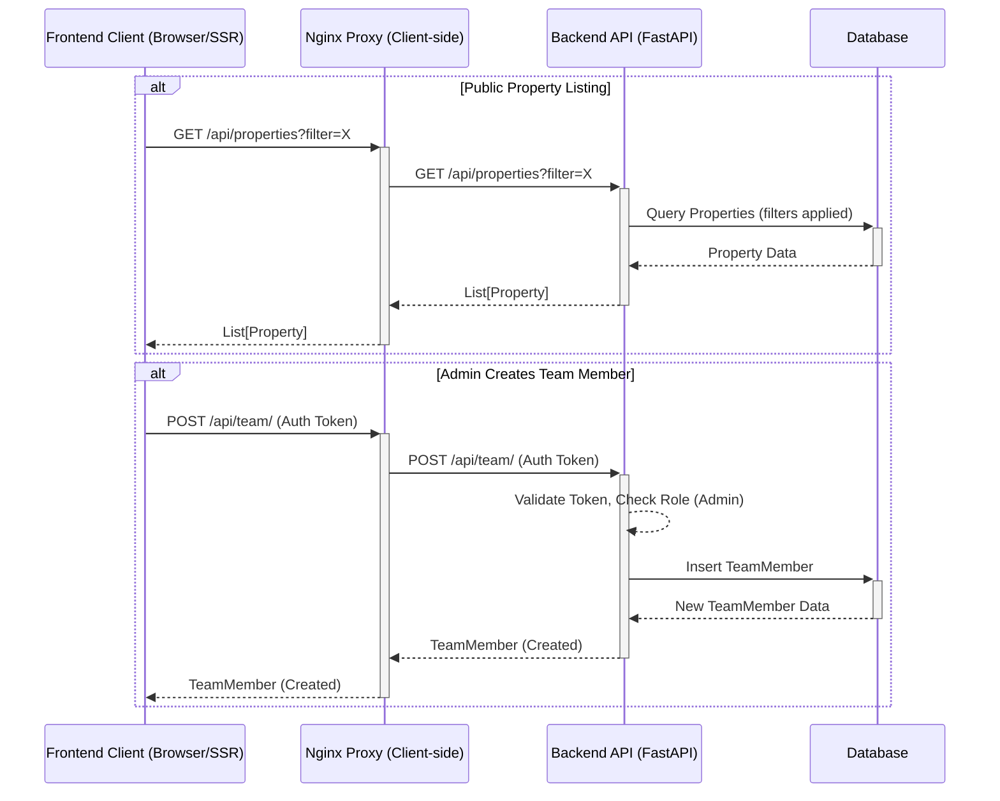

# System Architectural Map

## 1. Database Schemas

### 1.1 Property Model (`Property` - SQLAlchemy)
- Source: [`backend/models.py`](backend/models.py:43)

| Field Name         | SQLAlchemy Type        | Relationships / Notes                                     |
|--------------------|------------------------|-----------------------------------------------------------|
| id                 | Integer                | Primary Key, Index                                        |
| title              | String                 | Index                                                     |
| description        | String                 |                                                           |
| price              | Float                  |                                                           |
| location           | String                 |                                                           |
| bedrooms           | Integer                |                                                           |
| bathrooms          | Integer                |                                                           |
| square_feet        | Integer                |                                                           |
| property_type      | String                 | e.g., 'House', 'Apartment'                                |
| listing_type       | String                 | Nullable                                                  |
| status             | String                 | Default: "available"                                      |
| image_url          | String                 | Nullable (likely main/cover image)                        |
| latitude           | Float                  | Nullable                                                  |
| longitude          | Float                  | Nullable                                                  |
| is_featured        | Boolean                | Default: False                                            |
| created_at         | DateTime(timezone=True)| Server default: func.now()                                |
| updated_at         | DateTime(timezone=True)| On update: func.now()                                     |
| owner_id           | Integer                | ForeignKey("users.id"), Nullable                          |
| assigned_to_id     | Integer                | ForeignKey("users.id"), Nullable                          |
| created_by_user_id | Integer                | ForeignKey("users.id"), Nullable                          |
| owner              | relationship           | To `User` model (via `owner_id`)                          |
| assigned_to        | relationship           | To `User` model (via `assigned_to_id`)                    |
| created_by         | relationship           | To `User` model (via `created_by_user_id`)                |
| images             | relationship           | To `PropertyImage` model, cascade delete                  |
| clicks             | relationship           | To `PropertyClick` model                                  |

### 1.2 Team Member Model (`TeamMember` - SQLAlchemy)
- Source: [`backend/models.py`](backend/models.py:87)

| Field Name | SQLAlchemy Type | Relationships / Notes |
|------------|-----------------|-----------------------|
| id         | Integer         | Primary Key, Index    |
| name       | String          | Not Nullable          |
| position   | String          |                       |
| image_url  | String          | Nullable              |
| order      | Integer         | Default: 0            |

### 1.3 Property Pydantic Schemas
- Source: [`backend/schemas.py`](backend/schemas.py:1)
- Key Schemas:
    - **`PropertyBase`**: Common fields (`title`, `description`, `price`, `location`, `property_type`, `listing_type`, `bedrooms`, `bathrooms`, `square_feet`, `image_url` (HttpUrl), `latitude`, `longitude`, `is_featured`, `assigned_to_id`, `created_by_user_id`). All fields are optional or have defaults in the base.
    - **`PropertyCreate(PropertyBase)`**: For creation. Adds `additional_image_urls: Optional[List[HttpUrl]]`.
    - **`PropertyUpdate(PropertyBase)`**: For updates. All `PropertyBase` fields become optional. Adds `additional_image_urls: Optional[List[HttpUrl]]`, `delete_image_ids: Optional[List[int]]`.
    - **`Property(PropertyBase)`**: For responses. Includes `id`, `created_at`, `updated_at`, `images: List[PropertyImage]`, `clicks: List[PropertyClick]`, `assigned_to: Optional[User]`, `created_by: Optional[User]`.
    - **`PropertyImage`**: `id`, `property_id`, `image_url` (HttpUrl), `order`.

### 1.4 Team Member Pydantic Schemas
- Source: [`backend/schemas.py`](backend/schemas.py:1)
- Key Schemas:
    - **`TeamMemberBase`**: `name` (str), `position` (Optional[str]), `image_url` (Optional[str]), `order` (Optional[int]).
    - **`TeamMemberCreate(TeamMemberBase)`**: For creation.
    - **`TeamMemberUpdate`**: For updates. `name`, `position`, `image_url`, `order` are all Optional.
    - **`TeamMember(TeamMemberBase)`**: For responses. Includes `id`.

## 2. API Endpoints

### 2.1 Listings (Properties) API
- Source: [`backend/routers/properties.py`](backend/routers/properties.py:1)
- Base Path: `/api/properties`

#### 2.1.1 List Properties
- **Method:** GET
- **Path:** `/`
- **Description:** Retrieves a list of properties. Supports pagination, search, and extensive filtering.
- **Query Parameters:** `skip`, `limit`, `search`, `property_type`, `listing_type`, `min_price`, `max_price`, `min_bedrooms`, `max_bedrooms`, `min_bathrooms`, `max_bathrooms`, `min_area`, `max_area`.
- **Response:** `200 OK`, `List[schemas.Property]`
- **Permissions:** Public. `staff` role sees a filtered list based on `assigned_to_id`.

#### 2.1.2 Get Single Property
- **Method:** GET
- **Path:** `/{property_id}/`
- **Description:** Retrieves details for a specific property.
- **Path Parameters:** `property_id: int`
- **Response:** `200 OK`, `schemas.Property`
- **Permissions:** Public.

#### 2.1.3 Create Property
- **Method:** POST
- **Path:** `/`
- **Description:** Creates a new property listing.
- **Request Body:** `schemas.PropertyCreate`
- **Response:** `201 Created`, `schemas.Property`
- **Permissions:** Authenticated Manager (`auth_utils.require_manager`).

#### 2.1.4 Update Property
- **Method:** PUT
- **Path:** `/{property_id}/`
- **Description:** Updates an existing property listing.
- **Path Parameters:** `property_id: int`
- **Request Body:** `schemas.PropertyUpdate`
- **Response:** `200 OK`, `schemas.Property`
- **Permissions:** Authenticated Manager (`auth_utils.require_manager`).

#### 2.1.5 Delete Property
- **Method:** DELETE
- **Path:** `/{property_id}/`
- **Description:** Deletes a property listing.
- **Path Parameters:** `property_id: int`
- **Response:** `204 No Content`
- **Permissions:** Authenticated Manager (`auth_utils.require_manager`).

#### 2.1.6 Track Property Click
- **Method:** POST
- **Path:** `/{property_id}/track-click/`
- **Description:** Records a click event for a property.
- **Path Parameters:** `property_id: int`
- **Request:** `Request` object (for IP, User-Agent)
- **Response:** `201 Created`, `schemas.PropertyClick`
- **Permissions:** Public.

### 2.2 Team Members API
- Source: [`backend/routers/team.py`](backend/routers/team.py:1)
- Base Path: `/api/team`

#### 2.2.1 List Team Members
- **Method:** GET
- **Path:** `/`
- **Description:** Retrieves a list of team members. Supports pagination.
- **Query Parameters:** `skip`, `limit`.
- **Response:** `200 OK`, `List[schemas.TeamMember]`
- **Permissions:** Public.

#### 2.2.2 Get Single Team Member
- **Method:** GET
- **Path:** `/{member_id}/`
- **Description:** Retrieves details for a specific team member.
- **Path Parameters:** `member_id: int`
- **Response:** `200 OK`, `schemas.TeamMember`
- **Permissions:** Public.

#### 2.2.3 Create Team Member
- **Method:** POST
- **Path:** `/`
- **Description:** Adds a new team member.
- **Request Body:** `schemas.TeamMemberCreate`
- **Response:** `201 Created`, `schemas.TeamMember`
- **Permissions:** Authenticated Admin (`auth_utils.require_admin`).

#### 2.2.4 Update Team Member
- **Method:** PUT
- **Path:** `/{member_id}/`
- **Description:** Updates an existing team member's details.
- **Path Parameters:** `member_id: int`
- **Request Body:** `schemas.TeamMemberUpdate`
- **Response:** `200 OK`, `schemas.TeamMember`
- **Permissions:** Authenticated Admin (`auth_utils.require_admin`).

#### 2.2.5 Delete Team Member
- **Method:** DELETE
- **Path:** `/{member_id}/`
- **Description:** Deletes a team member.
- **Path Parameters:** `member_id: int`
- **Response:** `204 No Content`
- **Permissions:** Authenticated Admin (`auth_utils.require_admin`).

## 3. Frontend-Backend Communication

### 3.1 Listings (Properties) Flow
- **Public Read Operations:**
    - **Service:** [`frontend/services/propertyService.js`](frontend/services/propertyService.js:1)
    - **`fetchProperties(query)`:** Calls `GET /api/properties?{query}`.
    - **`fetchProperty(id)`:** Calls `GET /api/properties/{id}/`.
    - **API Base:** Dynamically resolved (e.g., `/api/` client-side, `http://proxy/api` server-side).
- **Admin CRUD Operations:**
    - Admin panel pages (e.g., under [`frontend/pages/admin/properties/`](frontend/pages/admin/properties/)) interact with the `POST`, `PUT`, `DELETE` endpoints listed in section 2.1. These calls are typically authenticated. Specific frontend components making these calls are not detailed here but would use standard `fetch` or a similar HTTP client.

### 3.2 Team Members Flow
- **Public Read Operations:**
    - **Page Component:** [`frontend/pages/about.js`](frontend/pages/about.js:1)
    - **`fetchTeamMembers()` (in `useEffect`):** Calls `GET /api/team/`.
    - **API Base:** Uses `process.env.NEXT_PUBLIC_API_URL` (e.g., `/api/`).
    - Image URLs are resolved using `NEXT_PUBLIC_BACKEND_STATIC_ROOT`.
- **Admin CRUD Operations:**
    - Admin panel pages (e.g., under [`frontend/pages/admin/team/`](frontend/pages/admin/team/)) interact with the `POST`, `PUT`, `DELETE` endpoints listed in section 2.2. These calls are authenticated.

## 4. Inter-service/Component Communication (Other)
- **Image Storage:** Images for properties and team members appear to be uploaded to the backend and served from a static directory (e.g., `backend/static/uploads/`). Frontend constructs URLs using `NEXT_PUBLIC_BACKEND_STATIC_ROOT` or relies on full URLs if provided by the API (e.g. for `PropertyImage` schema).
- **Database:** The backend interacts with the database (SQLite, based on `habitat_api.db`) via SQLAlchemy ORM within CRUD functions. No direct database access from the frontend.
- **Authentication:** JWT-based. Admin panel frontend components ([`frontend/components/AdminLayout.js`](frontend/components/AdminLayout.js:1)) manage tokens and make authenticated requests. Backend uses `auth_utils` for token validation and role checks (`require_manager`, `require_admin`).

## 5. Data Flow Diagram (Simplified)

This diagram illustrates a typical public data fetch and an admin-authenticated creation flow.